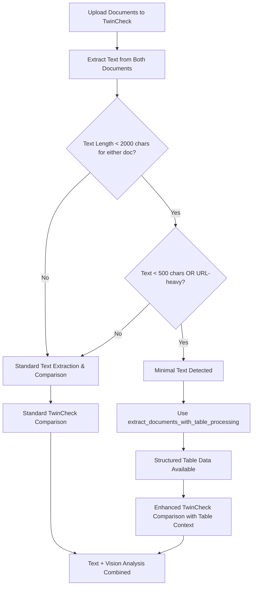

# TwinCheck Minimal Text Detection and Structured Table Extraction Enhancement

## Problem Addressed

The user requested that TwinCheck (Compare functionality) also apply the same **minimal text detection** and **structured table extraction** capabilities that were implemented for the chatbot's Full Document Scan mode and VeraDoc.

Previously, TwinCheck would:

- Extract text using standard text extraction (`extract_text_from_file_unified`)
- Use vision analysis for document comparison
- Not detect or handle documents with minimal text content that contain valuable structured table data

## Solution Implemented

Enhanced TwinCheck's `extract_text_from_file` function to include the **same logic** as the chatbot's Full Document Scan mode and VeraDoc for:

1. **Minimal Text Detection**: Identify documents with insufficient embedded text
2. **Structured Table Extraction**: Use `extract_documents_with_table_processing()` for consistent table data extraction
3. **Processing Strategy**: Apply the same decision logic as other document processing modes

## 🔧 **Key Changes**

### File Modified

- `backend/app/api/routes/twincheck.py` - Function `extract_text_from_file`

### Processing Enhancement Details

#### Before Enhancement

```python
def extract_text_from_file(file: UploadFile) -> str:
    from app.services.document_utils import extract_text_from_file_unified

    file_content = file.file.read()
    return extract_text_from_file_unified(file_content, file.filename or "unknown")
```

#### After Enhancement

```python
def extract_text_from_file(file: UploadFile) -> str:
    from app.services.document_utils import extract_text_from_file_unified, extract_documents_with_table_processing

    file_content = file.file.read()

    # First, extract text using standard method
    document_text = extract_text_from_file_unified(file_content, file.filename or "unknown")

    # Determine if we have minimal text content (same logic as other enhanced modes)
    has_minimal_text = False

    if document_text and document_text.strip():
        total_text_length = len(document_text.strip())

        # Check for minimal text content
        if total_text_length < 2000:  # Less than 2000 characters total
            content_preview = document_text[:1000].lower()
            text_length = len(document_text.strip())

            # Check for URL-heavy or minimal content patterns
            is_url_heavy = (
                ("Sample tables" in content_preview and "apa.org" in content_preview)
                or ("style-grammar-guidelines" in content_preview)
                or (content_preview.count("/") > 5 and "http" in content_preview)
            )

            if text_length < 500 or is_url_heavy:
                has_minimal_text = True

    # If minimal text detected, try structured table extraction
    if has_minimal_text:
        llm = ChatOpenAI(model="gpt-4o-mini", temperature=0.0)
        structured_documents, table_extraction_data = (
            extract_documents_with_table_processing(
                file_content, file.filename or "unknown", llm
            )
        )

        if structured_documents:
            # Use structured table content instead of minimal text
            enhanced_text = "\n\n".join([doc.page_content for doc in structured_documents])
            return enhanced_text

    return document_text
```

## 📊 **Processing Strategy**

TwinCheck now follows the same processing logic as other document modes:

### Text Analysis Criteria

- **Total Length Check**: Documents with < 2000 characters flagged for analysis
- **Minimal Text Threshold**: < 500 characters triggers structured processing
- **URL-Heavy Detection**: Documents with high URL density (likely image pages)
- **Content Pattern Recognition**: APA tables and style guides detection

### Processing Methods

1. **Standard Text Processing**: For documents with sufficient embedded text
2. **Structured Table Extraction**: For minimal text documents (same as Vector Search and VeraDoc)
3. **Enhanced Comparison**: Compare structured table data instead of minimal text
4. **Vision Integration**: Combine structured data with visual analysis for comprehensive comparisons

## 🎯 **Expected Results**

### TwinCheck Processing Enhancement

✅ **Minimal Text Detection**: Identifies image-heavy documents automatically  
✅ **Structured Table Processing**: Uses same function as Vector Search, Full Document Scan, and VeraDoc  
✅ **Rich Table Comparisons**: Compare structured JSON table data instead of minimal text  
✅ **Processing Consistency**: Unified behavior across all document processing modes

### Benefits for Document Comparisons

- **Better Table Analysis**: Rich structured data comparisons instead of minimal text diffs
- **Consistent Results**: Same table extraction quality across all functionalities
- **Enhanced Comparisons**: More meaningful analysis of documents with complex table structures
- **Intelligent Processing**: Automatic detection and handling of image-heavy documents

## 🔍 **Processing Flow**



## 🧪 **Testing**

To verify the enhancement:

1. **Upload APA table example PDF** to both document slots in TwinCheck
2. **Add comparison topic**: "Number of participants" or table-related questions
3. **Check backend logs** for minimal text detection and table extraction
4. **Verify comparison results** contain rich table context instead of minimal text diffs

### Expected Log Output

```
🎯 TwinCheck: APA table example.pdf flagged as minimal text (likely image-heavy): 812 chars
📸 TwinCheck: Using structured table extraction for APA table example.pdf due to minimal text content
📊 TwinCheck: Table processing extracted 2 structured tables
✅ TwinCheck: Using structured table content (4521 chars) instead of minimal text
```

## 🏆 **Benefits**

1. **Unified Processing**: All document modes now use consistent minimal text detection
2. **Enhanced Accuracy**: Better document comparisons for table-heavy documents
3. **Rich Context**: Structured table data improves comparison quality
4. **Intelligent Analysis**: Automatic detection of documents that benefit from table processing
5. **Future-Proof**: Centralized logic for easy maintenance and updates

## 📋 **Implementation Notes**

- Reuses existing `extract_documents_with_table_processing()` function
- Maintains backward compatibility with existing TwinCheck functionality
- Applies same detection thresholds as Full Document Scan and VeraDoc modes
- Includes error handling and graceful fallbacks to standard text processing
- Preserves all existing vision analysis capabilities
- Creates basic LLM instance for table processing within the utility function

## 🚀 **Integration Benefits**

This enhancement ensures that TwinCheck now provides the same high-quality document processing experience as:

- **Vector Search Mode**: Structured table extraction with embedded JSON
- **Full Document Scan Mode**: Minimal text detection and enhanced processing
- **VeraDoc Functionality**: Consistent table analysis across evaluations
- **Knowledge Base Processing**: Unified document handling approach

TwinCheck comparisons will now be more meaningful and accurate when analyzing documents with complex table structures, providing users with consistent, intelligent document processing across all platform features!
