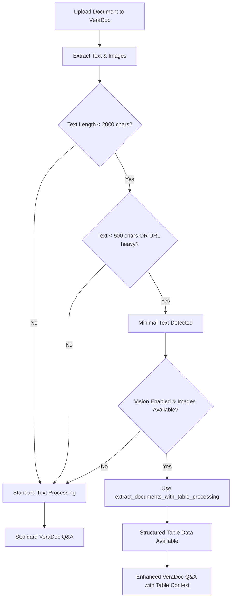

# VeraDoc Minimal Text Detection and Structured Table Extraction Enhancement

## Problem Addressed

The user requested that VeraDoc functionality also apply the same **minimal text detection** and **structured table extraction** capabilities that were implemented for the chatbot's Full Document Scan mode.

Previously, VeraDoc would:

- Extract text using standard text extraction
- Use vision analysis only as a fallback when no text was found
- Not detect or handle documents with minimal text content that contain valuable table data

## Solution Implemented

Enhanced VeraDoc's `process_rag_checklist` function to include the **same logic** as the chatbot's Full Document Scan mode for:

1. **Minimal Text Detection**: Identify documents with insufficient embedded text
2. **Structured Table Extraction**: Use `extract_documents_with_table_processing()` for consistent table data extraction
3. **Processing Strategy**: Apply the same decision logic as other document processing modes

## 🔧 **Key Changes**

### File Modified

- `backend/app/api/routes/veradoc.py` - Function `process_rag_checklist`

### Processing Enhancement Details

#### Before Enhancement

```python
# VeraDoc processing
document_text = await extract_text_from_file_async(content, file.filename)

# Extract images only for fallback when no text found
if not document_text:
    # Use vision as fallback
```

#### After Enhancement

```python
# VeraDoc processing with minimal text detection
document_text = await extract_text_from_file_async(content, file.filename)

# Determine if we have minimal text content (same logic as chatbot Full Document Scan)
has_minimal_text = False
if document_text and document_text.strip():
    total_text_length = len(document_text.strip())

    # Check for minimal text content
    if total_text_length < 2000:  # Less than 2000 characters total
        content_preview = document_text[:1000].lower()
        text_length = len(document_text.strip())

        # Check for URL-heavy or minimal content patterns
        is_url_heavy = (
            ("Sample tables" in content_preview and "apa.org" in content_preview)
            or ("style-grammar-guidelines" in content_preview)
            or (content_preview.count("/") > 5 and "http" in content_preview)
        )

        if text_length < 500 or is_url_heavy:
            has_minimal_text = True

# If minimal text detected and vision enabled, use structured table extraction
if has_minimal_text and vision_enabled and document_images:
    # Use the same table-aware processing as Full Document Scan and Vector Search
    structured_documents, table_extraction_data = (
        extract_documents_with_table_processing(
            content, file.filename, llm
        )
    )

    # Use processed documents with embedded table JSON as document text
    if structured_documents:
        document_text = "\n\n".join([doc.page_content for doc in structured_documents])
```

## 📊 **Processing Strategy**

VeraDoc now follows the same processing logic as other document modes:

### Text Analysis Criteria

- **Total Length Check**: Documents with < 2000 characters flagged for analysis
- **Minimal Text Threshold**: < 500 characters triggers structured processing
- **URL-Heavy Detection**: Documents with high URL density (likely image pages)
- **Content Pattern Recognition**: APA tables and style guides detection

### Processing Methods

1. **Standard Text Processing**: For documents with sufficient embedded text
2. **Structured Table Extraction**: For minimal text documents (same as Vector Search)
3. **Vision Fallback**: If table processing fails
4. **Text Fallback**: Last resort for error cases

## 🎯 **Expected Results**

### VeraDoc Processing Enhancement

✅ **Minimal Text Detection**: Identifies image-heavy documents automatically  
✅ **Structured Table Processing**: Uses same function as Vector Search and Full Document Scan  
✅ **Rich Table Data**: Embedded JSON table structures in document text  
✅ **Processing Consistency**: Unified behavior across all document processing modes

### Benefits for VeraDoc Evaluations

- **Better Table Analysis**: Rich structured data instead of minimal text
- **Consistent Results**: Same table extraction quality across all functionalities
- **Enhanced Q&A**: Better answers for documents with complex table structures
- **Visual Processing**: Intelligent handling of image-heavy documents

## 🔍 **Processing Flow**



## 🧪 **Testing**

To verify the enhancement:

1. **Upload APA table example PDF** to VeraDoc
2. **Use checklist with table questions**
3. **Verify processing logs** show minimal text detection and table extraction
4. **Check answers** contain rich table context instead of minimal text responses

### Expected Log Output

```
📸 Using structured table extraction for sample_table.pdf due to minimal text content
📊 Table processing extracted 2 structured tables
✅ Using structured table content (4521 chars) instead of minimal text
```

## 🏆 **Benefits**

1. **Unified Processing**: All document modes now use consistent minimal text detection
2. **Enhanced Accuracy**: Better VeraDoc evaluations for table-heavy documents
3. **Rich Context**: Structured table data improves Q&A quality
4. **Future-Proof**: Centralized logic for easy maintenance and updates

## 📋 **Implementation Notes**

- Reuses existing `extract_documents_with_table_processing()` function
- Maintains backward compatibility with existing VeraDoc functionality
- Applies same detection thresholds as Full Document Scan mode
- Includes error handling and graceful fallbacks
- Preserves all existing vision analysis capabilities

This enhancement ensures that VeraDoc now provides the same high-quality document processing experience as the chatbot's Vector Search and Full Document Scan modes, with consistent structured table extraction across all functionalities.
